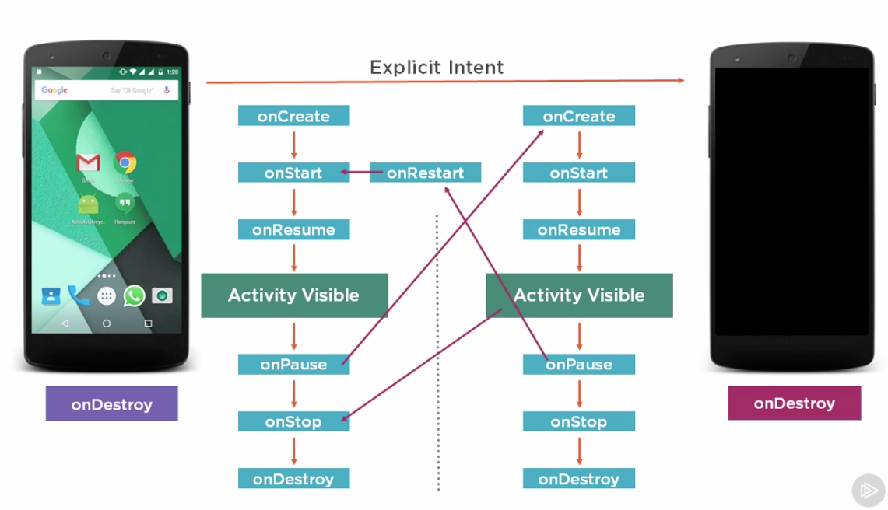
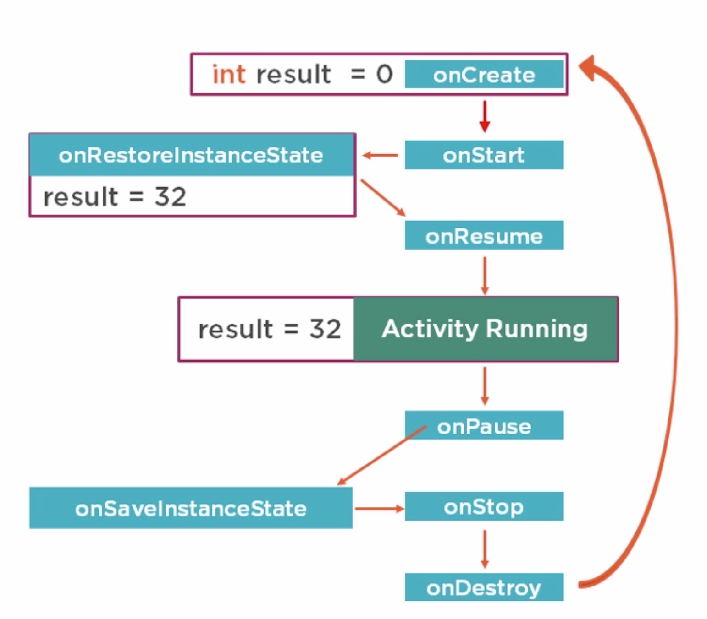
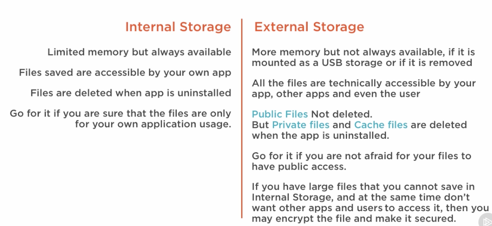
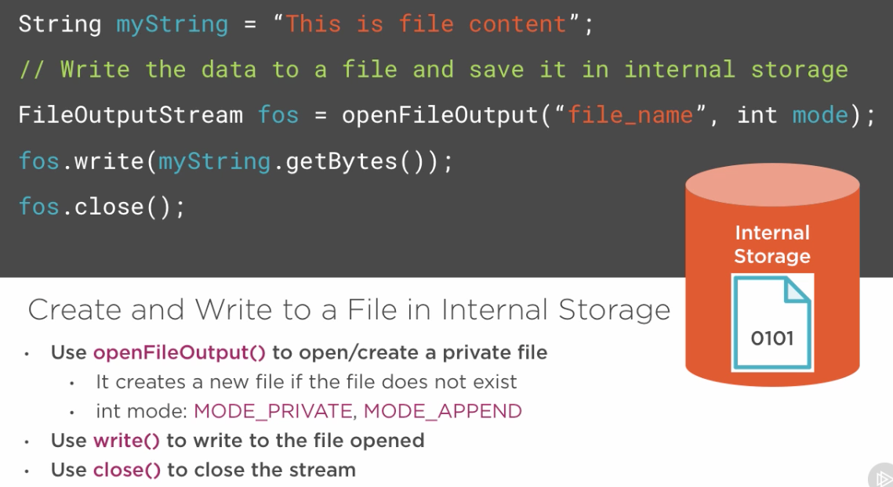
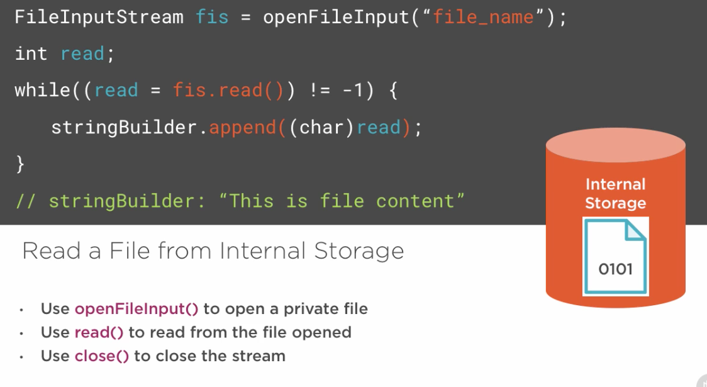

# Use min sdk API 15 - 16

# Lifecycle Methods
---
onCreate | onStart | onRestart | onResume | onPause | onStop  | onDestroy 

# Activity Lifecycle

# Restore Activity State Lifecycle

# Android Storage Options

# Internal Files

## Write Internal File

## Read Internal File

